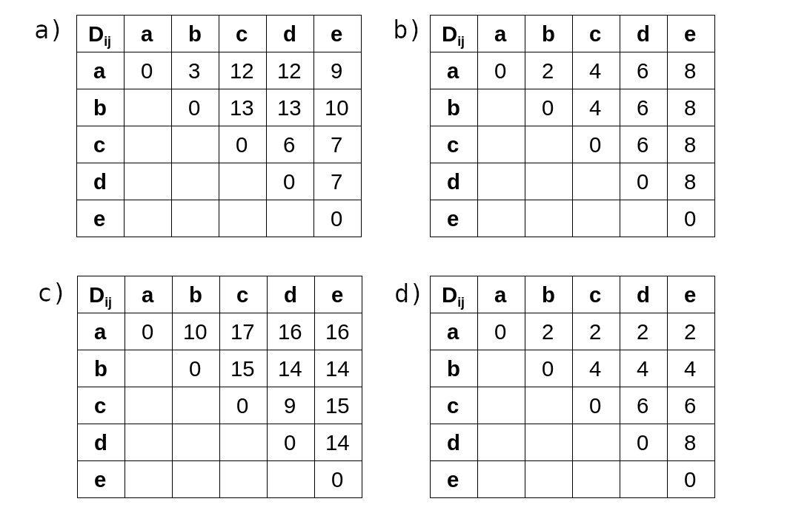

Albert-Ludwigs-Universität Freiburg

Lehrstuhl für Bioinformatik - Institut für Informatik - *http://www.bioinf.uni-freiburg.de*

Course ILIAS: [web page link](https://ilias.uni-freiburg.de/ilias.php?ref_id=2339316&cmdClass=ilobjcoursegui&cmd=view&cmdNode=zf:ns&baseClass=ilRepositoryGUI)

---
## Bioinformatics 1
###### WS 2021/2022
##### Exercise sheet 10: UPGMA
---

The following introduction is mainly taken from *en.wikipedia.org*.

A phylogenetic tree or evolutionary tree is a branching diagram or ”tree” showing the inferred
evolutionary relationships among various biological species or other entities based upon similarities
and differences in their physical and/or genetic characteristics. The taxa joined together in the tree
are implied to have descended from a common ancestor. In a rooted phylogenetic tree, each node
with descendants represents the inferred most recent common ancestor of the descendants, and the
edge lengths in some trees may be interpreted as time estimates. Each node is called a taxonomic
unit. Internal nodes are generally called hypothetical taxonomic units (HTUs) as they cannot be
directly observed.

**UPGMA** (Unweighted Pair Group Method with Arithmetic Mean) is a simple agglomerative or
hierarchical clustering method used in bioinformatics for the creation of phylogenetic trees. UPGMA
assumes a constant rate of evolution (molecular clock hypothesis), and is not a well-regarded
method for inferring phylogenetic trees unless this assumption has been tested and justified for the
data set being used.

Distances for a merged cluster e, where e = c ∪ d:

### _Exercise 1 - WPGMA_

Calculate the according evolutionary tree using WPGMA and the pairwise distances in the following distance matrix.

| Dij| a  | b  | c  | d  | e  |
|---------------|----|----|----|----|----|
| **a**         |  0 |  3 | 12 | 12 |  9 |
| **b**         |    |  0 | 13 | 13 | 10 |
| **c**         |    |    |  0 |  6 |  7 |
| **d**         |    |    |    |  0 |  7 |
| **e**         |    |    |    |    |  0 |

**a)** Which leaves should be selected first?

- [ ] c and d
- [ ] a and b
- [ ] d and e

**b)** Calculate the corresponding distance for the set of leaves from **a**.

**c)** Given your answers from **a** and **b**, which of the following distance matrices corresponds
to the correct distances from the set of leaves (or internal node) in **a** to all other leaves.

**1.**

| Dij| {a,b}  | c    | d    | e   |
|---------------|--------|------|------|-----|
| **{a,b}**     |  0     | 12.5 | 12.5 | 9.5 |
| **c**         |        |  0   | 13   | 7   |
| **d**         |        |      |  0   |  7  |
| **e**         |        |      |      |  0  |

**2.**

| Dij| {a,b}  | c    | d    | e   |
|---------------|--------|------|------|-----|
| **{a,b}**     |  0     | 10.5 | 10.5 | 9.5 |
| **c**         |        |  0   | 13   | 7   |
| **d**         |        |      |  0   |  7  |
| **e**         |        |      |      |  0  |

**3.**

| Dij| {c,d}  | a    | b    | e   |
|---------------|--------|------|------|-----|
| **{c,d}**     |  0     |  12  | 13   |  7  |
| **a**         |        |  0   | 13   |  7  |
| **b**         |        |      |  0   |  7  |
| **e**         |        |      |      |  0  |

**d)** Which nodes are joined next given the correct distance matrix from **c**?

- [ ] c and d
- [ ] {a,b} and e
- [ ] {c,d} and e
- [ ] e and a

**e)** Fill in the following distance matrix (both, upper and lower triangle).

  
Hint: (Click to open)

  If you did not end up with  these clusters after a-d, your current solution is wrong

| Dij| {a,b}  | {c,d}| e    |
|---------------|--------|------|------|
| **{a,b}**     |  0     |      |      |
| **{c,d}**     |        |  0   |      |
| **e**         |        |      |  0   |

**f)** What does the part of the tree look like in newick format after selecting and joining
your answer from **e)**

- [ ] ((c : 3, d : 3) : 3.5, e : 3.5)
- [ ] ((c : 3, d : 3) : 0.5, e : 3.5)
- [ ] ((a : 1.5, b : 1.5) : 2.75, e : 4.25)

**g)** Following the approach from the previous exercises, which of the following
representations of the tree is correct? (Trees are given in [Newick format](https://en.wikipedia.org/wiki/Newick_format))
Feel free to inspect them using an [online tool](http://www.trex.uqam.ca/index.php?action=newick&project=trex)

- [ ] ((a : 1.5, b : 1.5) : 4, ((c : 3, d : 3) : 0.5, e : 3.5) : 2);
- [ ] ((a : 1.5, b : 1.5) : 4.25, ((c : 3, d : 3) : 0.5, e : 3.5) : 2.25);
- [ ] (((c : 3, d : 3) : 3.5, e : 3.5): 4, (a : 1.5, b : 1.5) : 2);

### _Exercise 2 - UPGMA_

**a)** Imagine using  UPGMA instead of WPGMA for construction of a tree. Which of the following
statements is True?

- [ ] There will only be a difference in edge lengths. Overall topology will stay the same.
- [ ] The tree in **_Exercise 1_** will not change
- [ ] UPGMA is equal to WPGMA if the number of leaves in the two clusters (|c| and |d|) is the same.
- [ ] UPGMA can end up with wrong topologies when using non-ultrametric distances.

### _Exercise 3 - Ultrametric_

Which of the following distance matrices are ultrametric?

### _Exercise 4 - Programming assignment_

a) Implement the function 'convert_to_nodes' which takes the distance info and converts it to list of nodes.

b) Implement the function 'merge_best_pair' which takes a list of elements which can be both nodes and trees, finds the best pair to merge based on the distance, merges two closest objects and returns a list with the merged object as well as the remaining ones use compute_distance for that purpose.

c) Implement the function 'build_the_tree' which takes the distance_info and outputs the final tree use your implementations of convert_to_nodes and merge_best_pair.